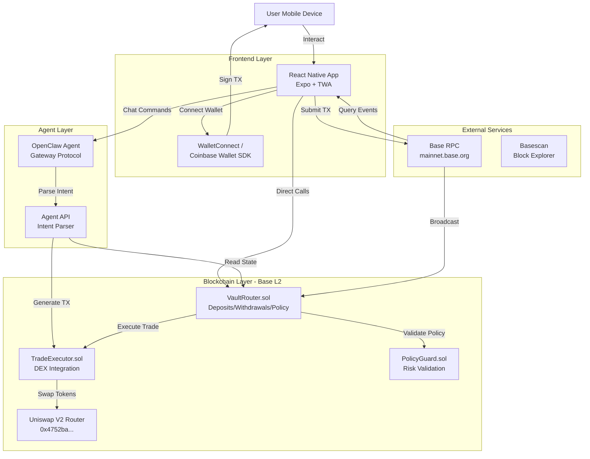

# Design Document: BluePilot — Hands-Free DeFi Trading

## Overview

BluePilot is a mobile-first, hands-free DeFi trading platform. Users set their trading rules once—trade size, slippage, cooldowns, and allowed tokens—and BluePilot executes trades automatically within those safe, on-chain limits. The system is built for automation, security, and accessibility.

**Core Components:**
1. **Smart Contracts (Base L2):** VaultRouter, TradeExecutor, PolicyGuard for funds, trades, and rule enforcement
2. **BluePilot Agent:** Conversational AI using Gateway Protocol for intent parsing and transaction generation
3. **React Native Mobile App:** Wallet integration, hands-free trade execution, policy management, and history

The architecture prioritizes hands-free automation (set rules, trade automatically), user-controlled signing, on-chain policy enforcement, and a mobile-first, accessible experience.

## System Architecture



---
All diagrams include alt text and clear headings for accessibility. See [requirements.md](requirements.md) for detailed user stories and acceptance criteria.
```

### Component Interaction Flow

**Trade Execution Flow:**
1. User inputs trade intent via Mobile App or OpenClaw Agent
2. Agent/App calls PolicyGuard to validate against user policy
3. If valid, TradeExecutor prepares swap transaction
4. Unsigned transaction returned to user for signing
5. User signs with wallet (WalletConnect/Coinbase Wallet)
6. Signed transaction submitted to Base L2 via RPC
7. TradeExecutor executes swap via Uniswap V2 Router
8. Events emitted, Mobile App updates UI with confirmation

**Policy Update Flow:**
1. User configures policy via Mobile App or "/policy" command
2. VaultRouter.setPolicy() called with new parameters
3. PolicyUpdated event emitted
4. Mobile App and Agent cache updated policy

## Components and Interfaces

### Smart Contracts

#### VaultRouter.sol

**Purpose:** Main entry point for user funds and policy management

**State Variables:**
```solidity
// User vault balances: user => token => amount
mapping(address => mapping(address => uint256)) public vaultBalances;

// User policies: user => Policy struct
mapping(address => Policy) public userPolicies;

// Policy struct
struct Policy {
    uint16 maxSlippageBps;      // Max slippage in basis points (100 = 1%)
    uint256 maxTradeSize;       // Max trade size in wei
    uint32 cooldownSeconds;     // Cooldown between trades
    uint32 lastTradeTimestamp;  // Timestamp of last trade
    address[] tokenAllowlist;   // Allowed tokens for trading
}
```

**Key Functions:**
```solidity
function deposit(address token, uint256 amount) external payable nonReentrant
function withdraw(address token, uint256 amount) external nonReentrant
function setPolicy(
    uint16 maxSlippageBps,
    uint256 maxTradeSize,
    uint32 cooldownSeconds,
    address[] calldata tokenAllowlist
) external
function executeTrade(
    address tokenIn,
    address tokenOut,
    uint256 amountIn,
    uint256 minAmountOut
) external nonReentrant
```

**Events:**
```solidity
event Deposit(address indexed user, address indexed token, uint256 amount);
event Withdrawal(address indexed user, address indexed token, uint256 amount);
event PolicyUpdated(address indexed user, Policy policy);
event TradeInitiated(address indexed user, address tokenIn, address tokenOut, uint256 amountIn);
```

**Inheritance:**
- OpenZeppelin Ownable (for admin functions)
- OpenZeppelin ReentrancyGuard (for deposit/withdraw/trade)

#### TradeExecutor.sol

**Purpose:** Execute token swaps via Uniswap V2 on Base

**State Variables:**
```solidity
IUniswapV2Router02 public immutable uniswapRouter;
address public immutable WETH;

// Uniswap V2 Router on Base: 0x4752ba5dbc23f44d87826276bf6fd6b1c372ad24
```

**Key Functions:**
```solidity
function swapETHForTokens(
    address tokenOut,
    uint256 amountIn,
    uint256 minAmountOut,
    address recipient
) external payable returns (uint256 amountOut)

function swapTokensForETH(
    address tokenIn,
    uint256 amountIn,
    uint256 minAmountOut,
    address recipient
) external returns (uint256 amountOut)

function swapTokensForTokens(
    address tokenIn,
    address tokenOut,
    uint256 amountIn,
    uint256 minAmountOut,
    address recipient
) external returns (uint256 amountOut)

function getAmountOut(
    address tokenIn,
    address tokenOut,
    uint256 amountIn
) external view returns (uint256 amountOut)
```

**Events:**
```solidity
event TradeExecuted(
    address indexed user,
    address indexed tokenIn,
    address indexed tokenOut,
    uint256 amountIn,
    uint256 amountOut,
    uint256 timestamp
);
```

**Inheritance:**
- OpenZeppelin ReentrancyGuard

#### PolicyGuard.sol

**Purpose:** Validate trades against user-defined risk policies

**Key Functions:**
```solidity
function validateTrade(
    address user,
    address token,
    uint256 tradeSize,
    uint256 slippageBps,
    Policy memory policy
) external view returns (bool)

function checkTradeSize(uint256 tradeSize, uint256 maxTradeSize) public pure returns (bool)

function checkSlippage(uint256 slippageBps, uint256 maxSlippageBps) public pure returns (bool)

function checkCooldown(uint32 lastTradeTimestamp, uint32 cooldownSeconds) public view returns (bool)

function checkTokenAllowlist(address token, address[] memory allowlist) public pure returns (bool)
```

**Custom Errors:**
```solidity
error TradeSizeExceeded(uint256 requested, uint256 max);
error SlippageExceeded(uint256 requested, uint256 max);
error CooldownNotElapsed(uint32 remainingSeconds);
error TokenNotAllowed(address token);
```

### OpenClaw Agent

#### Agent API Endpoints

**POST /api/agent/simulate**
```typescript
Request: {
  command: string;           // e.g., "/simulate swap 0.1 ETH for USDC"
  userAddress: string;       // User's wallet address
  chainId: number;           // 8453 for Base
}

Response: {
  success: boolean;
  simulation: {
    tokenIn: string;
    tokenOut: string;
    amountIn: string;
    estimatedAmountOut: string;
    slippagePercent: number;
    gasEstimate: string;
    policyViolations: string[];
  }
}
```

**POST /api/agent/execute**
```typescript
Request: {
  command: string;           // e.g., "/execute swap 0.1 ETH for USDC"
  userAddress: string;
  chainId: number;
}

Response: {
  success: boolean;
  transaction: {
    to: string;              // Contract address
    data: string;            // Encoded function call
    value: string;           // ETH value in wei
    gasLimit: string;
  }
}
```

**GET /api/agent/policy**
```typescript
Request: {
  userAddress: string;
  chainId: number;
}

Response: {
  success: boolean;
  policy: {
    maxSlippageBps: number;
    maxTradeSize: string;
    cooldownSeconds: number;
    lastTradeTimestamp: number;
    tokenAllowlist: string[];
  }
}
```

**GET /api/agent/history**
```typescript
Request: {
  userAddress: string;
  chainId: number;
  limit?: number;
}

Response: {
  success: boolean;
  transactions: Array<{
    hash: string;
    timestamp: number;
    tokenIn: string;
    tokenOut: string;
    amountIn: string;
    amountOut: string;
    status: 'pending' | 'confirmed' | 'failed';
  }>
}
```

#### Gateway Protocol Integration

The OpenClaw Agent uses Gateway Protocol to ensure:
- **Request Authentication**: Verify user identity via wallet signature
- **Intent Parsing**: Convert natural language to structured trade parameters
- **Policy Validation**: Check trade against on-chain policy before generating transaction
- **Transaction Generation**: Create unsigned transaction data for user signing
- **No Key Access**: Agent never accesses or stores private keys

### Mobile Application

#### Technology Stack

- **Framework**: React Native 0.73+ with Expo SDK 50+
- **Web3 Library**: ethers.js v6 or viem for contract interaction
- **Wallet Integration**: WalletConnect v2 + Coinbase Wallet SDK
- **State Management**: React Context API + AsyncStorage for persistence
- **Navigation**: React Navigation v6 (Bottom Tabs)
- **UI Components**: Custom components following Base design system
- **Build Tools**: Expo EAS Build for native compilation, Bubblewrap CLI for TWA

#### Screen Structure

**Home Screen** (`/screens/HomeScreen.tsx`)
- Portfolio value (total vault balance in USD)
- Recent trades list (last 5 transactions)
- Quick action buttons (Deposit, Trade)
- Network indicator (Base Mainnet/Sepolia)

**Trade Screen** (`/screens/TradeScreen.tsx`)
- Token selector (dropdown with allowlist tokens)
- Amount input with max button
- Swap direction toggle (ETH ↔ Token)
- Simulate button (shows estimated output)
- Execute button (generates transaction for signing)
- Slippage tolerance slider

**Policy Screen** (`/screens/PolicyScreen.tsx`)
- Max slippage input (percentage)
- Max trade size input (ETH/USD)
- Cooldown period input (seconds)
- Token allowlist manager (add/remove tokens)
- Save button (calls VaultRouter.setPolicy)

**History Screen** (`/screens/HistoryScreen.tsx`)
- Transaction list with infinite scroll
- Filter by status (all/pending/confirmed/failed)
- Pull-to-refresh
- Transaction cards showing: hash (truncated), timestamp, token pair, amounts, status icon
- Tap to open Basescan link

#### Key React Native Components

**WalletConnectButton** (`/components/WalletConnectButton.tsx`)
```typescript
interface WalletConnectButtonProps {
  onConnect: (address: string) => void;
  onDisconnect: () => void;
}

// Handles WalletConnect v2 modal, connection state, address display
```

**TradeSimulator** (`/components/TradeSimulator.tsx`)
```typescript
interface TradeSimulatorProps {
  tokenIn: string;
  tokenOut: string;
  amountIn: string;
  userAddress: string;
  onSimulationComplete: (result: SimulationResult) => void;
}

// Calls TradeExecutor.getAmountOut, PolicyGuard.validateTrade
```

**TransactionCard** (`/components/TransactionCard.tsx`)
```typescript
interface TransactionCardProps {
  hash: string;
  timestamp: number;
  tokenIn: string;
  tokenOut: string;
  amountIn: string;
  amountOut: string;
  status: 'pending' | 'confirmed' | 'failed';
  onPress: () => void;
}

// Displays transaction with status indicator, opens Basescan on tap
```

#### Contract Integration Layer

**contracts/VaultRouterContract.ts**
```typescript
import { ethers } from 'ethers';
import VaultRouterABI from './abis/VaultRouter.json';

export class VaultRouterContract {
  private contract: ethers.Contract;
  
  constructor(provider: ethers.Provider, address: string) {
    this.contract = new ethers.Contract(address, VaultRouterABI, provider);
  }
  
  async deposit(token: string, amount: bigint, signer: ethers.Signer): Promise<ethers.TransactionResponse>;
  async withdraw(token: string, amount: bigint, signer: ethers.Signer): Promise<ethers.TransactionResponse>;
  async setPolicy(policy: Policy, signer: ethers.Signer): Promise<ethers.TransactionResponse>;
  async getUserPolicy(userAddress: string): Promise<Policy>;
  async getVaultBalance(userAddress: string, token: string): Promise<bigint>;
}
```

**contracts/TradeExecutorContract.ts**
```typescript
export class TradeExecutorContract {
  private contract: ethers.Contract;
  
  constructor(provider: ethers.Provider, address: string) {
    this.contract = new ethers.Contract(address, TradeExecutorABI, provider);
  }
  
  async swapETHForTokens(
    tokenOut: string,
    amountIn: bigint,
    minAmountOut: bigint,
    signer: ethers.Signer
  ): Promise<ethers.TransactionResponse>;
  
  async getAmountOut(
    tokenIn: string,
    tokenOut: string,
    amountIn: bigint
  ): Promise<bigint>;
}
```

## Data Models

### Smart Contract Data Structures

**Policy Struct** (Solidity)
```solidity
struct Policy {
    uint16 maxSlippageBps;      // 0-10000 (0-100%), packed to save gas
    uint256 maxTradeSize;       // In wei, no upper limit
    uint32 cooldownSeconds;     // 0-4294967295 seconds, packed
    uint32 lastTradeTimestamp;  // Unix timestamp, packed
    address[] tokenAllowlist;   // Dynamic array of ERC20 addresses
}
```

**Storage Layout Optimization:**
- `maxSlippageBps` (uint16) + `cooldownSeconds` (uint32) + `lastTradeTimestamp` (uint32) = 80 bits → fits in 1 storage slot with padding
- `maxTradeSize` (uint256) = 1 storage slot
- `tokenAllowlist` = 1 slot for length + N slots for addresses

### Frontend Data Models

**UserPolicy** (TypeScript)
```typescript
interface UserPolicy {
  maxSlippageBps: number;        // 0-10000
  maxTradeSize: string;          // Wei string
  cooldownSeconds: number;       // Seconds
  lastTradeTimestamp: number;    // Unix timestamp
  tokenAllowlist: string[];      // Array of token addresses
}
```

**Transaction** (TypeScript)
```typescript
interface Transaction {
  hash: string;                  // 0x-prefixed hex
  timestamp: number;             // Unix timestamp
  tokenIn: string;               // Token address or 'ETH'
  tokenOut: string;              // Token address or 'ETH'
  amountIn: string;              // Wei string
  amountOut: string;             // Wei string
  status: 'pending' | 'confirmed' | 'failed';
  blockNumber?: number;
  gasUsed?: string;
}
```

**SimulationResult** (TypeScript)
```typescript
interface SimulationResult {
  tokenIn: string;
  tokenOut: string;
  amountIn: string;
  estimatedAmountOut: string;
  slippagePercent: number;
  gasEstimate: string;
  policyViolations: string[];    // Empty if valid
  priceImpact: number;           // Percentage
}
```

**WalletState** (TypeScript)
```typescript
interface WalletState {
  address: string | null;
  chainId: number | null;
  connected: boolean;
  provider: ethers.BrowserProvider | null;
  signer: ethers.Signer | null;
}
```

### Event Data Structures

**Deposit Event**
```solidity
event Deposit(
    address indexed user,
    address indexed token,
    uint256 amount
);
```

**TradeExecuted Event**
```solidity
event TradeExecuted(
    address indexed user,
    address indexed tokenIn,
    address indexed tokenOut,
    uint256 amountIn,
    uint256 amountOut,
    uint256 timestamp
);
```

**PolicyUpdated Event**
```solidity
event PolicyUpdated(
    address indexed user,
    Policy policy
);
```

### Configuration Constants

**Network Configuration** (TypeScript)
```typescript
export const NETWORKS = {
  BASE_MAINNET: {
    chainId: 8453,
    name: 'Base',
    rpcUrl: 'https://mainnet.base.org',
    blockExplorer: 'https://basescan.org',
    uniswapV2Router: '0x4752ba5dbc23f44d87826276bf6fd6b1c372ad24',
    nativeCurrency: { name: 'Ethereum', symbol: 'ETH', decimals: 18 }
  },
  BASE_SEPOLIA: {
    chainId: 84532,
    name: 'Base Sepolia',
    rpcUrl: 'https://sepolia.base.org',
    blockExplorer: 'https://sepolia.basescan.org',
    uniswapV2Router: '0x...',  // Testnet router address
    nativeCurrency: { name: 'Ethereum', symbol: 'ETH', decimals: 18 }
  }
};
```

**Design System Constants** (TypeScript)
```typescript
export const COLORS = {
  primary: '#0052FF',      // Base blue
  background: '#0A0B0D',   // Dark background
  surface: '#1A1B1F',      // Card/surface background
  textPrimary: '#FFFFFF',  // Primary text
  textSecondary: '#A0A0AB', // Secondary text
  success: '#00D395',      // Success green
  error: '#FF4444',        // Error red
  warning: '#FFB800'       // Warning yellow
};

export const TYPOGRAPHY = {
  headerBold: { fontFamily: 'Inter-Bold', fontSize: 24, lineHeight: 32 },
  bodyRegular: { fontFamily: 'Inter-Regular', fontSize: 16, lineHeight: 24 },
  monoAddress: { fontFamily: 'RobotoMono-Regular', fontSize: 14, lineHeight: 20 }
};

export const SPACING = {
  buttonHeight: 48,
  bottomNavHeight: 64,
  borderRadiusButton: 12,
  borderRadiusCard: 16,
  minTouchTarget: 44
};
```


## Correctness Properties

*A property is a characteristic or behavior that should hold true across all valid executions of a system—essentially, a formal statement about what the system should do. Properties serve as the bridge between human-readable specifications and machine-verifiable correctness guarantees.*

### Smart Contract Properties

**Property 1: Deposit increases vault balance**
*For any* user, token, and deposit amount, executing a deposit should increase the user's vault balance for that token by exactly the deposited amount.
**Validates: Requirements 1.1**

**Property 2: Withdrawal decreases vault balance and increases wallet balance**
*For any* user, token, and withdrawal amount (where vault balance >= withdrawal amount), executing a withdrawal should decrease the vault balance by the withdrawal amount and increase the user's wallet balance by the same amount.
**Validates: Requirements 1.2**

**Property 3: Insufficient balance withdrawals revert**
*For any* user, token, and withdrawal amount where vault balance < withdrawal amount, attempting withdrawal should revert with an error.
**Validates: Requirements 1.3**

**Property 4: Deposit and withdrawal events are emitted**
*For any* deposit or withdrawal operation, an event should be emitted containing the user address, token address, and amount.
**Validates: Requirements 1.4**

**Property 5: Policy round-trip consistency**
*For any* valid policy configuration, setting the policy then reading it back should return values equivalent to what was set.
**Validates: Requirements 2.1, 2.2**

**Property 6: Policy update events are emitted**
*For any* policy update operation, a PolicyUpdated event should be emitted containing the user address and new policy parameters.
**Validates: Requirements 2.3**

**Property 7: Trade execution calls correct Uniswap router**
*For any* valid trade, the TradeExecutor should interact with the Uniswap V2 Router at address 0x4752ba5dbc23f44d87826276bf6fd6b1c372ad24.
**Validates: Requirements 3.1**

**Property 8: Swap enforces minimum output amount**
*For any* executed swap, the actual output amount should be greater than or equal to the specified minimum output amount (slippage protection).
**Validates: Requirements 3.4**

**Property 9: Trade events are emitted**
*For any* executed trade, a TradeExecuted event should be emitted with input token, output token, amounts, and timestamp.
**Validates: Requirements 3.5**

**Property 10: Invalid trades revert with errors**
*For any* trade that fails validation or execution, the transaction should revert with a descriptive error message.
**Validates: Requirements 3.6**

**Property 11: Trade size validation**
*For any* trade where trade size > user's max trade size, the PolicyGuard should reject the trade with TradeSizeExceeded error.
**Validates: Requirements 4.1**

**Property 12: Slippage validation**
*For any* trade where slippage percentage > user's max slippage, the PolicyGuard should reject the trade with SlippageExceeded error.
**Validates: Requirements 4.2**

**Property 13: Cooldown validation**
*For any* trade where (current timestamp - last trade timestamp) < cooldown period, the PolicyGuard should reject the trade with CooldownNotElapsed error.
**Validates: Requirements 4.3**

**Property 14: Token allowlist validation**
*For any* trade where the token is not in the user's allowlist, the PolicyGuard should reject the trade with TokenNotAllowed error.
**Validates: Requirements 4.4**

**Property 15: Valid trades pass all policy checks**
*For any* trade that satisfies all policy constraints (size, slippage, cooldown, allowlist), the PolicyGuard should return true and allow execution.
**Validates: Requirements 4.6**

**Property 16: Input parameter validation**
*For any* function call with invalid input parameters (e.g., slippage > 10000, trade size = 0), the contract should reject the input with appropriate validation error.
**Validates: Requirements 10.5**

### Agent Properties

**Property 17: Simulate command returns simulation results**
*For any* valid "/simulate" command with trade parameters, the OpenClaw Agent should return a simulation result containing estimated amounts, slippage, gas estimate, and policy violations (if any).
**Validates: Requirements 6.1**

**Property 18: Execute command returns unsigned transaction**
*For any* valid "/execute" command that passes policy validation, the OpenClaw Agent should return unsigned transaction data with correct contract address, function call data, and value.
**Validates: Requirements 6.2**

**Property 19: History command returns transaction data**
*For any* "/history" command, the OpenClaw Agent should query blockchain events and return formatted transaction history with hashes, timestamps, tokens, amounts, and statuses.
**Validates: Requirements 6.4**

### Mobile Application Properties

**Property 20: Trade simulation calls view functions**
*For any* trade simulation request, the Mobile App should call TradeExecutor.getAmountOut and PolicyGuard.validateTrade view functions to estimate output and check policy compliance.
**Validates: Requirements 7.1**

**Property 21: Simulation displays required fields**
*For any* completed simulation, the result should contain input amount, estimated output amount, slippage percentage, gas estimate, and policy violations array.
**Validates: Requirements 7.2**

**Property 22: Simulation indicates policy violations**
*For any* simulation where the trade would violate policy rules, the result should include non-empty policy violations array with specific violation descriptions.
**Validates: Requirements 7.3**

**Property 23: Simulation errors display user-friendly messages**
*For any* failed simulation, the Mobile App should display an error message that explains the failure reason in user-friendly language (not raw error codes).
**Validates: Requirements 7.5**

**Property 24: Transaction history displays required fields**
*For any* transaction in the history list, the display should include transaction hash, timestamp, token pair, amounts, and status indicator.
**Validates: Requirements 8.1**

**Property 25: Transaction tap opens correct Basescan link**
*For any* transaction card tap, the Mobile App should open a Basescan URL in the format https://basescan.org/tx/{hash} where {hash} is the transaction hash.
**Validates: Requirements 8.2**

**Property 26: History fetches events from both contracts**
*For any* history query, the Mobile App should fetch events from both VaultRouter (Deposit, Withdrawal, PolicyUpdated) and TradeExecutor (TradeExecuted) contracts.
**Validates: Requirements 8.3**

**Property 27: Wrong network triggers switch prompt**
*For any* detected chain ID that is not 8453 (Base Mainnet) or 84532 (Base Sepolia), the Mobile App should display a prompt asking the user to switch networks.
**Validates: Requirements 12.5**

**Property 28: Transaction failures display error messages**
*For any* failed transaction, the Mobile App should display an error message explaining why the transaction failed.
**Validates: Requirements 13.1**

**Property 29: Pending transactions show loading indicator**
*For any* transaction in pending state, the Mobile App should display a loading indicator with estimated confirmation time.
**Validates: Requirements 13.2**

**Property 30: Failed transactions show retry button**
*For any* transaction in failed state, the Mobile App should display a retry button that allows re-attempting the transaction.
**Validates: Requirements 13.4**

**Property 31: Interactive elements meet minimum touch target size**
*For any* interactive UI element (button, tap target), the touch target size should be at least 44x44 pixels for accessibility.
**Validates: Requirements 14.6**

### Property Reflection Notes

After analyzing all 84 acceptance criteria, I identified several opportunities to consolidate redundant properties:

- **Consolidated 2.1 and 2.2** into Property 5 (policy round-trip) since updating is just setting new values, and the round-trip test covers both initial set and updates
- **Combined multiple policy validation checks** (4.1-4.4) into separate properties (11-14) rather than one large property, as each checks a distinct policy rule and should fail with specific errors
- **Merged event emission checks** where appropriate (Properties 4, 6, 9) to test the general rule that operations emit events, rather than separate properties for each operation type
- **Excluded non-functional requirements** like code inspection items (10.1-10.4, 11.1-11.5) and deployment requirements (10.6) from properties, as these are better verified through code review and build processes
- **Excluded UI layout requirements** (5.1-5.8, 9.1-9.5, 12.1-12.4, 14.1-14.5) from properties as these are better tested through example-based UI tests and visual regression testing
- **Focused properties on behavioral invariants** that can be tested with randomized inputs rather than specific examples

This resulted in 31 core properties that provide comprehensive coverage of the system's functional correctness while avoiding redundancy.

## Error Handling

### Smart Contract Error Handling

**Custom Errors** (Solidity 0.8.x)
```solidity
// VaultRouter errors
error InsufficientVaultBalance(uint256 requested, uint256 available);
error InvalidSlippage(uint256 slippage);
error InvalidTradeSize(uint256 size);
error ZeroAddress();
error ZeroAmount();

// TradeExecutor errors
error SwapFailed(string reason);
error InsufficientOutputAmount(uint256 actual, uint256 minimum);
error InvalidPath();

// PolicyGuard errors
error TradeSizeExceeded(uint256 requested, uint256 max);
error SlippageExceeded(uint256 requested, uint256 max);
error CooldownNotElapsed(uint32 remainingSeconds);
error TokenNotAllowed(address token);
```

**Error Handling Patterns:**

1. **Input Validation**: All public functions validate inputs before processing
   ```solidity
   function deposit(address token, uint256 amount) external payable nonReentrant {
       if (token == address(0)) revert ZeroAddress();
       if (amount == 0) revert ZeroAmount();
       // ... rest of function
   }
   ```

2. **State Validation**: Check state conditions before state changes
   ```solidity
   function withdraw(address token, uint256 amount) external nonReentrant {
       uint256 balance = vaultBalances[msg.sender][token];
       if (balance < amount) revert InsufficientVaultBalance(amount, balance);
       // ... rest of function
   }
   ```

3. **External Call Protection**: Use try-catch for external calls
   ```solidity
   try uniswapRouter.swapExactETHForTokens{value: amountIn}(
       minAmountOut,
       path,
       recipient,
       deadline
   ) returns (uint256[] memory amounts) {
       return amounts[amounts.length - 1];
   } catch Error(string memory reason) {
       revert SwapFailed(reason);
   }
   ```

4. **Reentrancy Protection**: Use ReentrancyGuard on all state-changing functions
   ```solidity
   function executeTrade(...) external nonReentrant {
       // Safe from reentrancy attacks
   }
   ```

### Mobile Application Error Handling

**Error Categories:**

1. **Network Errors**
   - RPC connection failures
   - Timeout errors
   - Wrong network detection

2. **Wallet Errors**
   - User rejected transaction
   - Insufficient funds
   - Wallet not connected

3. **Contract Errors**
   - Policy violations
   - Insufficient vault balance
   - Slippage exceeded

4. **Validation Errors**
   - Invalid input amounts
   - Invalid token addresses
   - Invalid policy parameters

**Error Handling Implementation:**

```typescript
// Error handler utility
export class ErrorHandler {
  static getUserFriendlyMessage(error: any): string {
    // Contract errors
    if (error.data?.message?.includes('TradeSizeExceeded')) {
      return 'Trade size exceeds your maximum limit. Reduce the amount or update your policy.';
    }
    if (error.data?.message?.includes('SlippageExceeded')) {
      return 'Slippage is too high. Try increasing your slippage tolerance or wait for better prices.';
    }
    if (error.data?.message?.includes('CooldownNotElapsed')) {
      const match = error.data.message.match(/(\d+)/);
      const seconds = match ? match[1] : 'unknown';
      return `Cooldown period not elapsed. Wait ${seconds} seconds before trading again.`;
    }
    if (error.data?.message?.includes('TokenNotAllowed')) {
      return 'This token is not in your allowlist. Update your policy to trade this token.';
    }
    if (error.data?.message?.includes('InsufficientVaultBalance')) {
      return 'Insufficient vault balance. Deposit more funds before trading.';
    }
    
    // Wallet errors
    if (error.code === 4001) {
      return 'Transaction rejected. You cancelled the transaction in your wallet.';
    }
    if (error.code === -32603 && error.message?.includes('insufficient funds')) {
      return 'Insufficient funds for gas. Add more ETH to your wallet.';
    }
    
    // Network errors
    if (error.code === 'NETWORK_ERROR') {
      return 'Network connection failed. Check your internet connection and try again.';
    }
    if (error.code === 'TIMEOUT') {
      return 'Request timed out. The network may be congested. Try again.';
    }
    
    // Generic fallback
    return 'An unexpected error occurred. Please try again or contact support.';
  }
  
  static shouldRetry(error: any): boolean {
    // Retry on network errors, timeouts, and nonce errors
    return (
      error.code === 'NETWORK_ERROR' ||
      error.code === 'TIMEOUT' ||
      error.code === -32603 ||
      error.message?.includes('nonce')
    );
  }
}
```

**Retry Logic:**

```typescript
async function executeWithRetry<T>(
  fn: () => Promise<T>,
  maxRetries: number = 3,
  delayMs: number = 1000
): Promise<T> {
  let lastError: any;
  
  for (let attempt = 0; attempt < maxRetries; attempt++) {
    try {
      return await fn();
    } catch (error) {
      lastError = error;
      
      if (!ErrorHandler.shouldRetry(error) || attempt === maxRetries - 1) {
        throw error;
      }
      
      // Exponential backoff
      await new Promise(resolve => setTimeout(resolve, delayMs * Math.pow(2, attempt)));
    }
  }
  
  throw lastError;
}
```

**Offline Handling:**

```typescript
// Queue actions when offline
class OfflineQueue {
  private queue: Array<() => Promise<any>> = [];
  private isOnline: boolean = true;
  
  constructor() {
    window.addEventListener('online', () => this.processQueue());
    window.addEventListener('offline', () => this.isOnline = false);
  }
  
  async execute<T>(fn: () => Promise<T>): Promise<T> {
    if (this.isOnline) {
      return fn();
    } else {
      return new Promise((resolve, reject) => {
        this.queue.push(async () => {
          try {
            const result = await fn();
            resolve(result);
          } catch (error) {
            reject(error);
          }
        });
      });
    }
  }
  
  private async processQueue() {
    this.isOnline = true;
    while (this.queue.length > 0) {
      const fn = this.queue.shift();
      if (fn) await fn();
    }
  }
}
```

## Testing Strategy

### Dual Testing Approach

The Percolator system requires both **unit tests** and **property-based tests** for comprehensive coverage:

- **Unit tests**: Verify specific examples, edge cases, error conditions, and integration points
- **Property tests**: Verify universal properties across randomized inputs (minimum 100 iterations per test)

Both testing approaches are complementary and necessary. Unit tests catch concrete bugs in specific scenarios, while property tests verify general correctness across a wide input space.

### Smart Contract Testing

**Framework**: Hardhat with ethers.js and fast-check for property-based testing

**Unit Test Focus:**
- Specific deposit/withdrawal scenarios
- Policy configuration edge cases (slippage = 0, slippage = 10000, empty allowlist)
- Integration with Uniswap V2 Router (mock or fork testing)
- Event emission verification
- Access control (only owner can call admin functions)
- Gas usage benchmarks

**Property Test Focus:**
- Deposit/withdrawal invariants (Properties 1-3)
- Policy round-trip consistency (Property 5)
- Trade execution correctness (Properties 7-10)
- Policy validation rules (Properties 11-15)

**Property Test Configuration:**
```typescript
import fc from 'fast-check';

describe('VaultRouter Property Tests', () => {
  it('Property 1: Deposit increases vault balance', async () => {
    // Feature: percolator-defi-agent, Property 1: For any user, token, and deposit amount, executing a deposit should increase the user's vault balance for that token by exactly the deposited amount
    
    await fc.assert(
      fc.asyncProperty(
        fc.ethereumAddress(),  // user
        fc.ethereumAddress(),  // token
        fc.bigUintN(64),       // amount (reasonable size)
        async (user, token, amount) => {
          const balanceBefore = await vaultRouter.vaultBalances(user, token);
          await vaultRouter.connect(user).deposit(token, amount);
          const balanceAfter = await vaultRouter.vaultBalances(user, token);
          
          expect(balanceAfter).to.equal(balanceBefore + amount);
        }
      ),
      { numRuns: 100 }
    );
  });
});
```

**Test Network:**
- Use Hardhat local network for fast iteration
- Use Base Sepolia testnet for integration testing
- Consider forking Base Mainnet for realistic Uniswap testing

### OpenClaw Agent Testing

**Framework**: Jest with fast-check for property-based testing

**Unit Test Focus:**
- Command parsing for each command type (/simulate, /execute, /policy, /history)
- Error handling for malformed commands
- Gateway Protocol authentication flow
- Transaction data generation correctness

**Property Test Focus:**
- Simulate command returns valid results (Property 17)
- Execute command returns valid unsigned transactions (Property 18)
- History command returns formatted data (Property 19)

**Property Test Example:**
```typescript
import fc from 'fast-check';

describe('OpenClaw Agent Property Tests', () => {
  it('Property 17: Simulate command returns simulation results', async () => {
    // Feature: percolator-defi-agent, Property 17: For any valid "/simulate" command with trade parameters, the OpenClaw Agent should return a simulation result containing estimated amounts, slippage, gas estimate, and policy violations
    
    await fc.assert(
      fc.asyncProperty(
        fc.ethereumAddress(),  // tokenIn
        fc.ethereumAddress(),  // tokenOut
        fc.bigUintN(64),       // amountIn
        fc.integer({ min: 0, max: 10000 }),  // slippageBps
        async (tokenIn, tokenOut, amountIn, slippageBps) => {
          const command = `/simulate swap ${amountIn} ${tokenIn} for ${tokenOut}`;
          const result = await agent.handleCommand(command, userAddress, 8453);
          
          expect(result.success).toBe(true);
          expect(result.simulation).toHaveProperty('tokenIn');
          expect(result.simulation).toHaveProperty('tokenOut');
          expect(result.simulation).toHaveProperty('amountIn');
          expect(result.simulation).toHaveProperty('estimatedAmountOut');
          expect(result.simulation).toHaveProperty('slippagePercent');
          expect(result.simulation).toHaveProperty('gasEstimate');
          expect(result.simulation).toHaveProperty('policyViolations');
          expect(Array.isArray(result.simulation.policyViolations)).toBe(true);
        }
      ),
      { numRuns: 100 }
    );
  });
});
```

### Mobile Application Testing

**Framework**: Jest + React Native Testing Library + fast-check

**Unit Test Focus:**
- Component rendering (Home, Trade, Policy, History screens)
- Wallet connection flow
- Navigation between tabs
- UI interactions (button presses, input changes)
- Error message display
- Offline behavior

**Property Test Focus:**
- Trade simulation correctness (Properties 20-23)
- Transaction history display (Properties 24-26)
- Network detection (Property 27)
- Error handling (Properties 28-30)
- Touch target sizes (Property 31)

**Property Test Example:**
```typescript
import fc from 'fast-check';
import { render } from '@testing-library/react-native';

describe('Mobile App Property Tests', () => {
  it('Property 24: Transaction history displays required fields', async () => {
    // Feature: percolator-defi-agent, Property 24: For any transaction in the history list, the display should include transaction hash, timestamp, token pair, amounts, and status indicator
    
    await fc.assert(
      fc.asyncProperty(
        fc.array(
          fc.record({
            hash: fc.hexaString({ minLength: 64, maxLength: 64 }),
            timestamp: fc.integer({ min: 1600000000, max: 2000000000 }),
            tokenIn: fc.ethereumAddress(),
            tokenOut: fc.ethereumAddress(),
            amountIn: fc.bigUintN(64).map(n => n.toString()),
            amountOut: fc.bigUintN(64).map(n => n.toString()),
            status: fc.constantFrom('pending', 'confirmed', 'failed')
          }),
          { minLength: 1, maxLength: 20 }
        ),
        async (transactions) => {
          const { getAllByTestId } = render(
            <HistoryScreen transactions={transactions} />
          );
          
          const cards = getAllByTestId('transaction-card');
          expect(cards.length).toBe(transactions.length);
          
          transactions.forEach((tx, index) => {
            const card = cards[index];
            expect(card).toHaveTextContent(tx.hash.substring(0, 10));  // Truncated hash
            expect(card).toHaveTextContent(tx.tokenIn);
            expect(card).toHaveTextContent(tx.tokenOut);
            expect(card).toHaveTextContent(tx.amountIn);
            expect(card).toHaveTextContent(tx.amountOut);
            // Status indicator should be present (icon or text)
          });
        }
      ),
      { numRuns: 100 }
    );
  });
  
  it('Property 31: Interactive elements meet minimum touch target size', async () => {
    // Feature: percolator-defi-agent, Property 31: For any interactive UI element, the touch target size should be at least 44x44 pixels
    
    const { getAllByRole } = render(<TradeScreen />);
    const buttons = getAllByRole('button');
    
    buttons.forEach(button => {
      const { width, height } = button.props.style;
      expect(width).toBeGreaterThanOrEqual(44);
      expect(height).toBeGreaterThanOrEqual(44);
    });
  });
});
```

**E2E Testing:**
- Use Detox for end-to-end mobile testing
- Test complete flows: connect wallet → deposit → configure policy → simulate trade → execute trade → view history
- Test on both iOS and Android (via Expo)
- Test TWA installation and behavior on Android

### Test Coverage Goals

- **Smart Contracts**: 100% line coverage, 100% branch coverage
- **Agent API**: 90%+ line coverage, focus on command parsing and transaction generation
- **Mobile App**: 80%+ line coverage, focus on critical paths (wallet connection, trade execution, error handling)

### Continuous Integration

- Run unit tests on every commit
- Run property tests (100 iterations) on every PR
- Run E2E tests on main branch merges
- Generate coverage reports and fail if below thresholds
- Run gas usage reports for contract changes
